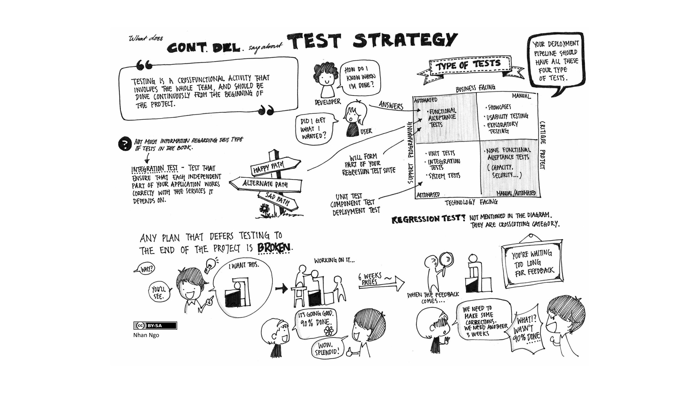

# Continuous Integration

# The problem

When creating and managing processes for large-scale, long term projects, mistakes can happen that aren't caught for years.

The cost of a mistake increases significantly with the length of time it takes to find it.

Waiting until launch can be *very* expensive

* $370 million
* Lots of PhD theses

# Old model

* Gather requirements
* Design
* Build
* Deploy

Some errors won't be found until the deployment stage.

## New model

Deployment happens continuously

# Fail Fast!

## Examples

### Toyota

We developed ICS - the Inspection Control System

Feedback is given at all stages of the manufacturing process

Defects are remedied as close as possible to their source

### TREC

#### Translating Research in Elder Care

http://www.trec.ualberta.ca/

Instruments:
* Facility
* Units
* Specialist
* Nurse
* Manager
* Health Care Aids

https://trec.svy.ca/app/account

Facility Management

https://hca.svy.ca/app/facilityunit/facilities

#### Considerations:

* Site (facility) management, including changes over time.
* Metadata management.
* Data collection.
* Interviewer training and management.
* Codebooks.
* Dashboards.
* Data exports.

# Tools

* Collaboration
* Metadata management
* Institutional memory
* Issue tracking
* Unit testing
* Source Control
* CI
* Dashboards/Monitoring

## Collaboration

### Realtime

* Face to face
* Skype
* Hangouts
* ...

### Near realtime

* Chatrooms
* Slack  (https://civictechto.slack.com/messages/general/team/jrootham/)
* Mattermost

* https://gitter.im/pydata/pandas

### Asynchonous

* Email

## Institutional Memory

The problem:

* People move on
* Processes aren't documented.
* The only person who knows how to import a certain file is a grad student who left 3 years ago
* The reasons *behind* processes aren't documented

Tools

* Wiki (https://github.com/pandas-dev/pandas/wiki)
* Evernote
* Sphinx (http://pandas.pydata.org/pandas-docs/stable/)
* Blogs  (https://trvrm.github.io/)

Record:

* What do we do
* How do we do it
* Why do we do it
* Who does it
* How do we know it's working

## Sharing Code, Processes, and documentation

https://try.jupyter.org/

https://nbviewer.jupyter.org/

Jupyter notebooks are an *incredible* tool.

* Write code
* Write documentation
* Write books
* Collaborate
* Explore

This presentation is written in Jupyter.

Sample use case

https://github.com/trvrm/notebooks/blob/master/bulk_psycopg2_inserts.ipynb

Publish to blog:

https://trvrm.github.io/bulk-psycopg2-inserts.html

Write the test before fixing the code.

https://github.com/pandas-dev/pandas/pull/11937/commits/7f00dbcd7dcef6c1354e36381e1501b5e95208ff
    
    
* write regression tests  (e.g. nosetests)
* use code coverage tools  (e.g. coverage)
* use code quality tools (e.g. flake8)

## Source Control

* Git  (https://github.com/trvrm/pandas/commit/7f00dbcd7dcef6c1354e36381e1501b5e95208ff)
* Mercurial
* Subversion

**Track everything in source control**

Source control isn't just for code.  This presentation is available for collaboration at https://github.com/trvrm/ci_presentation

## Continuous Integration

https://travis-ci.org/pandas-dev/pandas
 

* Tests are run automatically on every commit.
* Failed tests prevent upstream merges

## Monitoring

https://app.binarycanary.com/Dashboard

Get an SMS alert if:

* A data delivery pipeline fails
* A certificate expires
* A server stops responding
* A database goes offline
* A backup fails
* A scheduled task fails

## Dashboards

This is a broader concept.

* KANBAN: https://en.wikipedia.org/wiki/Kanban
* Surveymedia
    * Data aquisition
    * Processes monitoring

## Suggestions

- Pick the right tools for your process
- Don't be afraid to write your own
- Automate everything that can be automated
- Test everything
- Put everything in source control
- Do end-to-end integration as soon as possible.
- Mistakes increase in cost the longer it takes to find them

## Specifics

**TMIST**

#### Who, what, how, why, when, where?

* What are your sites?
* What data are you collecting?
* What time frame will you collect data over?
* What processes need implemented and documented?
* How do you record the rationale behind those processes?
* How do you manage changes to those processes?

# Discussion

## Resources

* https://github.com/
* https://www.mercurial-scm.org/
* https://about.mattermost.com/
* https://travis-ci.org/
* http://www.fabfile.org/
* http://www.pyinvoke.org/
* https://github.com/adam-p/markdown-here/wiki/Markdown-Cheatsheet
* http://www.mkdocs.org/
* https://try.jupyter.org/
* https://coverage.readthedocs.io/en/coverage-4.3.4/
* http://flake8.pycqa.org/en/latest/
* https://app.binarycanary.com/Dashboard

# Thank you!

Trevor Morgan

* https://trvrm.github.io
* https://nooro.com/

