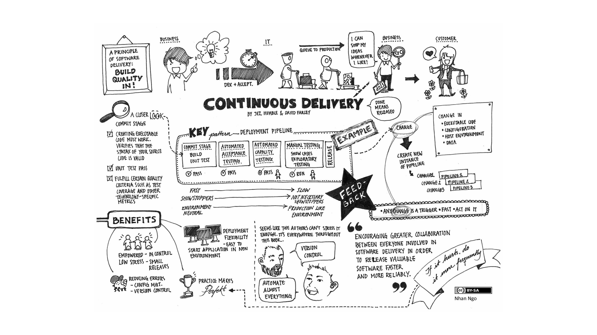
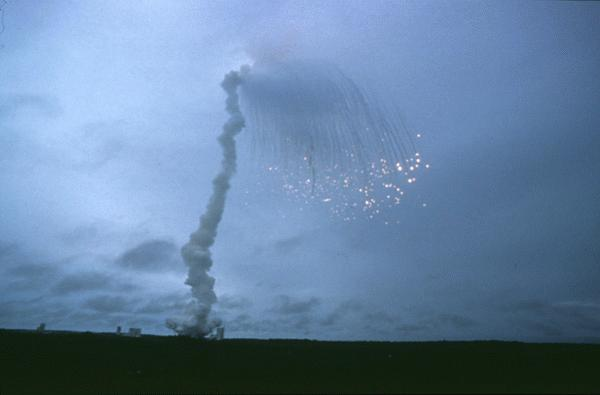

# Continuous Integration





# The problem

When creating and managing processes for large-scale, long term projects, mistakes can happen that aren't caught for years.

The cost of a mistake increases significantly with the length of time it takes to find it.

Waiting until launch can be *very* expensive




* $370 million
* Lots of PhD theses


# Old model


* Gather requirements
* Design
* Build
* Deploy


Some errors won't be found until the deployment stage.

# Fail Fast!

## Examples


### TREC
http://www.trec.ualberta.ca/

Instruments:
* Facility
* Units
* Specialist
* Nurse
* Manager
* Health Care Aids


Facility Management

https://hca.svy.ca/app/facilityunit/facilities


Considerations:

* Site (facility) management, including changes over time.
* Metadata management
* Data collection.
* Codebooks.
* Dashboards
* 

### Toyota

We developed ICS - the Inspection Control System

Feedback is given at all stages of the manufacturing process

Defects are remedied as close as possible to their source


### Tools
Regression Testing

- nosetests


Continuous Integration
- https://travis-ci.org/pandas-dev/pandas

Source control
- https://github.com/trvrm/pandas/commit/7f00dbcd7dcef6c1354e36381e1501b5e95208ff

Document sharing
Issue tracking.
Dashboards.


## Continuous Integration

CI can be applied at several levels.

Software

Processes

Enterprise


## Heading 2


```python

```
